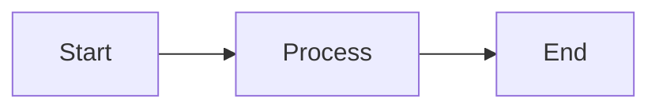

# mdview - Project Specification

Build a CLI tool called `mdview` that renders Markdown files in the terminal with full styling and Mermaid diagram support.

## Overview

`mdview` is like `cat` but for Markdown - it renders the file with proper formatting (headers, bold, italic, code blocks, tables, etc.) instead of showing raw text. The key differentiator is native Mermaid diagram support, which no existing tool provides.

## Tech Stack

- **Runtime**: Bun (TypeScript)
- **Markdown parsing**: `marked` + `marked-terminal`
- **Mermaid rendering**: `beautiful-mermaid` (converts Mermaid to ASCII/Unicode art)
- **Terminal styling**: `chalk`
- **Build**: `bun build --compile` for standalone binary

## Core Requirements

### CLI Interface

```
mdview <file>          # Render a markdown file
mdview -               # Read from stdin
mdview --help, -h      # Show help
mdview --version, -v   # Show version
```

### Features

1. **Markdown rendering** - Headers, bold, italic, lists, code blocks with syntax highlighting, tables, blockquotes, horizontal rules, links
2. **Mermaid diagrams** - Detect ```mermaid code blocks and render them as ASCII art using `beautiful-mermaid`
3. **Stdin support** - Pipe content via `cat README.md | mdview -`
4. **Responsive width** - Respect terminal width (`process.stdout.columns`)

### Example Usage

```bash
mdview README.md
curl -s https://raw.githubusercontent.com/user/repo/main/README.md | mdview -
```

## Dependencies

```json
{
  "dependencies": {
    "chalk": "^5.3.0",
    "marked": "^12.0.0",
    "marked-terminal": "^7.0.0",
    "beautiful-mermaid": "^0.1.0"
  },
  "devDependencies": {
    "@types/bun": "^1.1.0",
    "typescript": "^5.4.0"
  }
}
```

## Architecture

```
src/
  index.ts      # CLI entry point, argument parsing, file/stdin reading
  renderer.ts   # Markdown rendering, mermaid block detection
  mermaid.ts    # Mermaid-to-ASCII conversion using beautiful-mermaid
```

### Key Implementation Details

1. **Mermaid detection**: Use regex to find ```mermaid blocks before passing to marked
2. **Mermaid rendering**: Call `beautiful-mermaid`'s `renderMermaidAscii()` function
3. **Fallback**: If mermaid parsing fails, show the raw code in a box with an error message
4. **marked-terminal usage**:
   ```typescript
   import { marked } from "marked";
   import { markedTerminal } from "marked-terminal";

   marked.use(markedTerminal({ reflowText: true, width: 80 }));
   ```

## Build Commands

```bash
bun install                                    # Install deps
bun run src/index.ts README.md                 # Dev run
bun build src/index.ts --compile --outfile mdview  # Compile to binary
```

## Performance Target

- Startup time: <50ms for compiled binary
- Should feel responsive for typical README files

## Competitive Context

| Tool | Mermaid | Tables | Language |
|------|---------|--------|----------|
| Glow | ❌ | ✅ | Go |
| mdcat | ❌ | ❌ | Rust |
| Rich-CLI | ❌ | ✅ | Python |
| **mdview** | ✅ | ✅ | TypeScript |

The unique selling point is Mermaid support - no other terminal markdown renderer has this.

## Test File

Create `examples/test.md` with various markdown elements including mermaid diagrams to verify rendering:

~~~markdown
# Test Document

**Bold** and *italic* text.

## Code Block

```typescript
const x = 1;
```

## Mermaid Diagram



## Table

| Column 1 | Column 2 |
|----------|----------|
| Value 1  | Value 2  |
~~~
