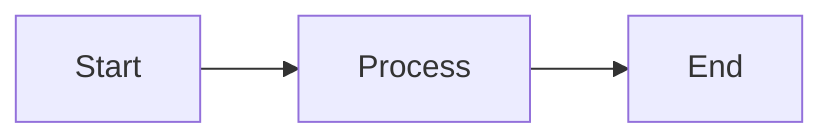

# mdview

A fast CLI tool to render Markdown files beautifully in the terminal, with full support for Mermaid diagrams as ASCII art.


## Features

- **Full Markdown rendering** - Headers, bold, italic, code blocks, tables, lists, links
- **Mermaid diagrams** - Converts Mermaid syntax to ASCII art flowcharts and diagrams
- **Stdin support** - Pipe content directly from other commands
- **Fast startup** - Under 50ms with compiled binary
- **Terminal-aware** - Automatically adapts to terminal width

## Installation

### Quick Install (recommended)

```bash
curl -fsSL https://raw.githubusercontent.com/tzachbon/mdview/main/install.sh | sh
```

This automatically detects your platform and installs the latest version to `~/.local/bin` (no sudo required).

**Options:**
```bash
# Install to system-wide directory (requires sudo)
curl -fsSL https://raw.githubusercontent.com/tzachbon/mdview/main/install.sh | sudo sh -s -- -b /usr/local/bin

# Install specific version
curl -fsSL https://raw.githubusercontent.com/tzachbon/mdview/main/install.sh | sh -s -- -v v1.0.0
```

> **Note:** Make sure `~/.local/bin` is in your PATH. Add `export PATH="$HOME/.local/bin:$PATH"` to your shell profile if needed.

### Manual Download

Download the appropriate binary for your platform from [Releases](https://github.com/tzachbon/mdview/releases):

| Platform | Binary |
|----------|--------|
| macOS (Apple Silicon) | `mdview-darwin-arm64` |
| macOS (Intel) | `mdview-darwin-x64` |
| Linux (x64) | `mdview-linux-x64` |
| Linux (ARM64) | `mdview-linux-arm64` |
| Windows (x64) | `mdview-windows-x64.exe` |

### From Source

Requires [Bun](https://bun.sh) v1.0 or later.

```bash
# Clone the repository
git clone https://github.com/tzachbon/mdview.git
cd mdview

# Install dependencies
bun install

# Build the binary
bun run build

# Optionally, move to your PATH
mkdir -p ~/.local/bin && mv mdview ~/.local/bin/
```

### Quick Start

```bash
# Render a markdown file
./mdview README.md

# Pipe from another command
cat document.md | ./mdview -

# Show help
./mdview --help
```

## Usage

```
mdview <file>          Render a markdown file
mdview -               Read from stdin
mdview --help, -h      Show help
mdview --version, -v   Show version
```

### Examples

**Render a file:**
```bash
mdview ./docs/api.md
```

**Pipe from curl:**
```bash
curl -s https://raw.githubusercontent.com/user/repo/main/README.md | mdview -
```

**Use with git:**
```bash
git show HEAD:README.md | mdview -
```

## Mermaid Support

mdview automatically detects Mermaid code blocks and renders them as ASCII art:

````markdown

````

Renders as:
```
┌───────┐     ┌─────────┐     ┌─────┐
│ Start ├────►│ Process ├────►│ End │
└───────┘     └─────────┘     └─────┘
```

Supported diagram types:
- Flowcharts (`graph`, `flowchart`)
- Sequence diagrams (`sequenceDiagram`)

## Development

### Prerequisites

- [Bun](https://bun.sh) v1.0+

### Setup

```bash
# Install dependencies
bun install

# Run in development
bun run src/index.ts examples/test.md

# Run tests
bun test

# Run tests with coverage
bun test --coverage

# Type check
bun tsc --noEmit

# Build binary
bun run build
```

### Project Structure

```
mdview/
├── src/
│   ├── index.ts          # CLI entry point
│   ├── renderer.ts       # Markdown rendering with mermaid detection
│   ├── mermaid.ts        # Mermaid to ASCII conversion
│   ├── *.test.ts         # Unit and integration tests
├── examples/
│   └── test.md           # Sample markdown file
├── package.json
└── tsconfig.json
```

## Configuration

mdview respects your terminal width automatically. No configuration file is needed.

| Environment | Behavior |
|-------------|----------|
| TTY terminal | Uses `process.stdout.columns` |
| Piped output | Defaults to 80 columns |

## Troubleshooting

### Mermaid diagrams show raw code

If a Mermaid diagram displays as raw code in a box, it means the diagram syntax is invalid. Check for:
- Missing diagram type declaration (`graph LR`, `sequenceDiagram`, etc.)
- Syntax errors in node definitions
- Unsupported diagram types

### Binary won't run

Ensure you built with the correct architecture:
```bash
bun run build  # Creates binary for current platform
```

## Tech Stack

- **Runtime**: [Bun](https://bun.sh) - Fast JavaScript runtime
- **Markdown**: [marked](https://marked.js.org/) + [marked-terminal](https://github.com/mikaelbr/marked-terminal)
- **Mermaid**: [beautiful-mermaid](https://github.com/niconiahi/beautiful-mermaid)
- **Styling**: [chalk](https://github.com/chalk/chalk)

## Acknowledgments

- [marked](https://marked.js.org/) for the excellent Markdown parser
- [marked-terminal](https://github.com/mikaelbr/marked-terminal) for terminal rendering
- [beautiful-mermaid](https://github.com/niconiahi/beautiful-mermaid) for ASCII diagram conversion
