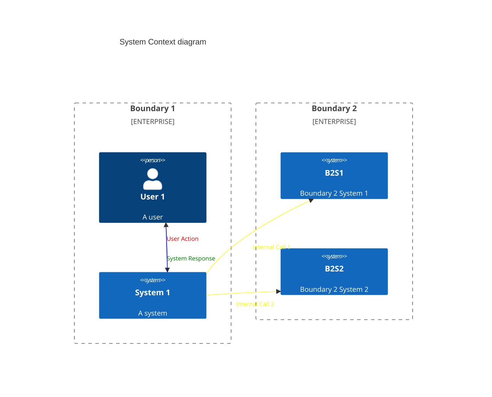

```mermaid
C4Context
    title System Context diagram

    Enterprise_Boundary(b0, "Boundary 1") {
        Person(user, "User 1", "A user")
        System(system, "System 1", "A system")
    }
    Enterprise_Boundary(b1, "Boundary 2") {
        System(b2s1, "B2S1", "Boundary 2 System 1")
        System(b2s2, "B2S2", "Boundary 2 System 2")
    }

    Rel(user, system, "User Action")
    Rel(system, user, "System Response")
    Rel(system, b2s1, "Internal Call 1")
    Rel(system, b2s2, "Internal Call 2")

    UpdateRelStyle(user, system, $textColor="red", $lineColor="blue", $offsetY="-20")
    UpdateRelStyle(system, user, $textColor="green", $lineColor="blue", $offsetY="+20")
    UpdateRelStyle(system, b2s1, $textColor="yellow", $lineColor="yellow", $offsetY="+20", $offsetX="-15")
    UpdateRelStyle(system, b2s2, $textColor="yellow", $lineColor="yellow", $offsetY="+20", $offsetX="-15")
```

