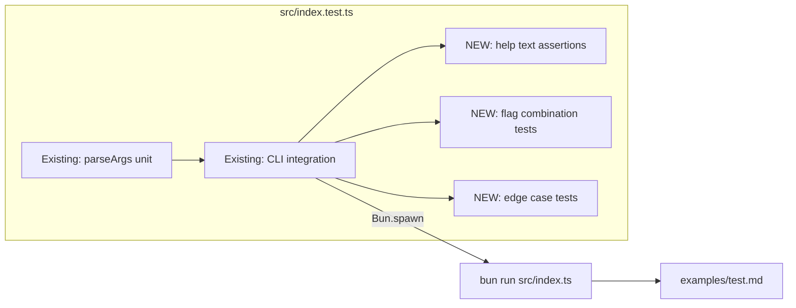

# Design: bat-cli-output (Hardening)

## Overview

Add integration tests for bat-style CLI flags and edge cases to `src/index.test.ts`. HELP text is already updated (lines 44-67 in index.ts already document `--plain`, `--paging`, `--style`). All new tests use existing patterns: `Bun.spawn` for CLI integration, `bun:test` describe/test/expect.

## Architecture

No new components. All changes are test additions to `src/index.test.ts`.



## Components

### HELP Text (US-1)

HELP text in `src/index.ts` lines 44-67 **already satisfies AC-1.1 through AC-1.4**:
- `--plain, -p` with "Disable all decorations" -- AC-1.1 (line 54)
- `--paging=<mode>` with never/always/auto -- AC-1.2 (line 55)
- `--style=<components>` with full/plain/header,numbers,grid -- AC-1.3 (lines 56-59)
- Example: `mdview README.md --style=plain` -- AC-1.4 (lines 62-66)

**Only AC-1.5 needs implementation**: integration test asserting `--help` output contains new flags.

### Integration Test Structure (US-2)

All new tests go in `src/index.test.ts` under `describe("CLI integration")`. Pattern matches existing tests (lines 339-489):

```typescript
// Pattern: spawn CLI, capture stdout/stderr, assert content
const proc = Bun.spawn(["bun", "run", CLI_PATH, ...flags], {
  stdout: "pipe",
  stderr: "pipe",
  env: { ...process.env, FORCE_COLOR: "1" },
});
const exitCode = await proc.exited;
const stdout = await new Response(proc.stdout).text();
```

**Key: `FORCE_COLOR=1`** must be set for all decoration tests to ensure decorations are applied even though test stdout is piped (not a TTY).

### Edge Case Tests (US-3)

| Test | Approach | Key Assertion |
|------|----------|---------------|
| Empty file | Create temp empty `.md`, spawn CLI | exit 0, no crash |
| Stdin + decorations | Pipe content via stdin with `FORCE_COLOR=1` | No `File:` header, numbers + grid present |
| `NO_COLOR` | Set `NO_COLOR=1`, omit `FORCE_COLOR` | Output lacks `│`, `─`, `File:` |
| `FORCE_COLOR` | Set `FORCE_COLOR=1` on piped output | Output contains decoration chars |

## Technical Decisions

| Decision | Options | Choice | Rationale |
|----------|---------|--------|-----------|
| Test location | New file vs existing | `src/index.test.ts` | Existing file has CLI integration section; keep cohesive |
| Temp files for edge cases | `Bun.write` temp file vs inline | `Bun.write` to `/tmp` | Clean, no fixture pollution |
| Decoration assertion strategy | Check ANSI codes vs check decoration chars | Check decoration chars (`│`, `─`, `File:`) | ANSI codes are chalk-version-dependent; chars are stable |
| Invalid `--style` test | Check stderr vs check exit code | Check both: exit 1 + stderr contains "unknown style" | Matches `parseStyle` throw behavior; note: error may surface as unhandled rejection depending on pipeline |

## File Structure

| File | Action | Purpose |
|------|--------|---------|
| `src/index.test.ts` | Modify | Add ~10 integration tests in 3 new describe blocks |

No new files needed.

## Test Design

### New describe blocks in `src/index.test.ts`

#### 1. Help text flag documentation (under `describe("help output")`)

```typescript
test("--help documents --plain flag", async () => {
  // spawn --help, assert stdout contains "--plain"
});

test("--help documents --paging flag", async () => {
  // assert stdout contains "--paging"
});

test("--help documents --style flag", async () => {
  // assert stdout contains "--style"
});
```

#### 2. Flag combination integration (new `describe("bat-style flags")`)

```typescript
test("--plain produces output without decorations", async () => {
  // spawn with --plain, FORCE_COLOR=1
  // assert: no "│", no "─", no "File:"
  // assert: still contains rendered content ("Test Document")
});

test("--style=numbers produces line numbers without header", async () => {
  // spawn with --style=numbers, FORCE_COLOR=1
  // assert: contains "│"
  // assert: no "File:"
});

test("--style=header produces header without line numbers", async () => {
  // spawn with --style=header, FORCE_COLOR=1
  // assert: contains "File:"
  // assert: no "│" in content lines
});

test("--paging=never writes to stdout and exits 0", async () => {
  // spawn with --paging=never
  // assert: exit 0, stdout has content
});

test("--style=full produces header, numbers, and grid", async () => {
  // spawn with --style=full, FORCE_COLOR=1
  // assert: contains "File:", "│", "─"
});

test("--style=invalid produces error", async () => {
  // spawn with --style=invalid
  // assert: exit 1 OR stderr contains "unknown style"
});
```

#### 3. Edge cases (new `describe("edge cases")`)

```typescript
test("empty markdown file renders without error", async () => {
  // write empty file to /tmp, spawn CLI on it
  // assert: exit 0
});

test("stdin with decorations shows numbers and grid but no filename header", async () => {
  // spawn with "-" and FORCE_COLOR=1, pipe content via stdin
  // assert: contains "│" (numbers), no "File:" (no filename for stdin)
});

test("NO_COLOR suppresses decorations", async () => {
  // spawn with NO_COLOR=1, without FORCE_COLOR
  // assert: no "│", no "─", no "File:"
});

test("FORCE_COLOR forces decorations when piped", async () => {
  // spawn with FORCE_COLOR=1 (stdout is piped, not TTY)
  // assert: contains "│" or "─" (decorations present)
});
```

## Error Handling

| Error Scenario | Handling Strategy | User Impact |
|----------------|-------------------|-------------|
| `--style=invalid` | `parseStyle` throws, caught by main catch | stderr: "unknown style component", exit 1 |
| Empty file | Renders empty string, decorator handles `""` | Clean exit 0, minimal output |
| Missing `less` for pager | `pipeToPager` catch falls back to stdout | Transparent to user |

## Edge Cases

- **Empty file + decorations**: `decorate("")` with numbers produces `"1 │ "` (tested in decorator.test.ts). Integration test confirms no crash.
- **Stdin + header**: `filename` is undefined for stdin, so `buildHeader` is skipped even when `style.header=true`. Test confirms no `File:` in output.
- **NO_COLOR + FORCE_COLOR both set**: Code checks `!noColor` last, so `NO_COLOR` wins. Not explicitly tested (out of scope per requirements).
- **--plain overrides --style**: `useDecorations=false` when `--plain` is set, bypassing style entirely. Already covered by parseArgs unit tests.

## Existing Patterns to Follow

Based on codebase analysis:
- **Bun.spawn pattern**: All CLI tests use `Bun.spawn(["bun", "run", CLI_PATH, ...])` with `stdout: "pipe"`, `stderr: "pipe"` (see index.test.ts lines 344, 358)
- **env override**: Tests that need color/decorations use `env: { ...process.env, FORCE_COLOR: "1" }` (lines 348, 453)
- **Response text pattern**: `await new Response(proc.stdout).text()` to read output (lines 350, 364)
- **describe nesting**: Top-level `describe("CLI integration")` with nested `describe` per feature area
- **Test naming**: Descriptive, starts with what is being tested (e.g., "--plain produces output without...")
- **Fixture file**: `examples/test.md` is used for all file-reading integration tests

## Implementation Steps

1. Add help text assertions to existing `describe("help output")` block in `src/index.test.ts` -- 3 tests for AC-1.5
2. Add new `describe("bat-style flags")` block with 6 tests for AC-2.1 through AC-2.6
3. Add new `describe("edge cases")` block with 4 tests for AC-3.1 through AC-3.4
4. Run `bun test` to verify all 183 existing + ~13 new tests pass
