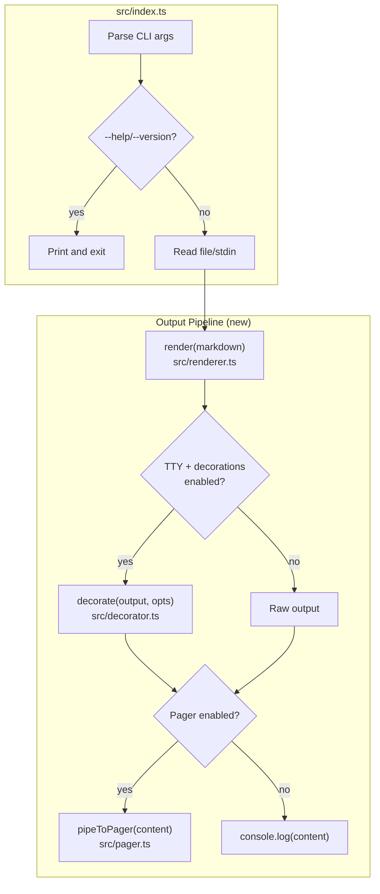
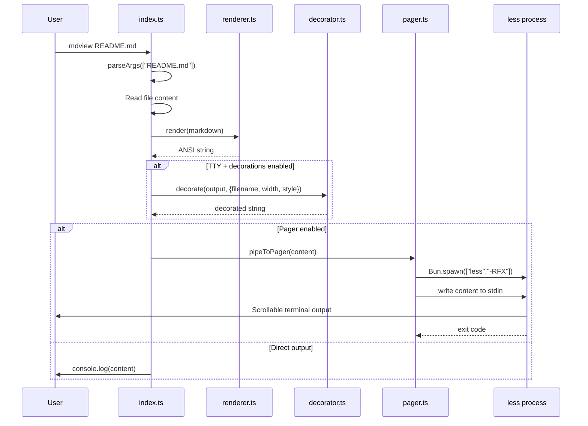

# Design: bat-style Output for mdview

## Overview

Add bat-style terminal output to mdview by inserting two new modules into the rendering pipeline: a **decorator** (file header, line numbers, grid borders) and a **pager** (less -RFX spawner). Both are post-processors that wrap the existing `render()` output. The existing `marked-terminal` + `cli-highlight` pipeline is untouched.

## Architecture



## New Modules

### src/decorator.ts

Handles: file header, line numbers, grid borders using chalk + Unicode box-drawing.

```typescript
/** Which decoration components are active */
export interface StyleComponents {
  header: boolean;
  numbers: boolean;
  grid: boolean;
}

export interface DecorateOptions {
  /** Filename for header (undefined = stdin, no header) */
  filename?: string;
  /** Terminal width */
  width: number;
  /** Active style components */
  style: StyleComponents;
}

/**
 * Wraps rendered ANSI output with bat-style decorations.
 * Pure function -- takes rendered string, returns decorated string.
 */
export function decorate(content: string, options: DecorateOptions): string;

/**
 * Parse --style flag value into StyleComponents.
 * "full" -> all true. "plain" -> all false. "numbers,grid" -> only those.
 * Throws on invalid component names.
 */
export function parseStyle(styleStr: string): StyleComponents;
```

**Internal structure:**

```
decorate(content, opts)
  1. Split content into lines
  2. Calculate gutter width from line count (Math.ceil(Math.log10(lineCount + 1)))
  3. If opts.style.header && opts.filename:
     - Build header line: chalk.dim(`File: ${basename(filename)}`)
  4. If opts.style.grid:
     - Build top border: "─".repeat(width) with optional ┬ at gutter junction
     - Build bottom border: "─".repeat(width) with optional ┴ at gutter junction
  5. If opts.style.numbers:
     - Prepend each line with right-aligned chalk.dim(lineNum) + " │ "
  6. Assemble: [header?, topBorder?, ...numberedLines, bottomBorder?]
  7. Return joined string
```

**Box-drawing characters used:**

| Character | Unicode | Usage |
|-----------|---------|-------|
| `│` | U+2502 | Gutter separator |
| `─` | U+2500 | Horizontal grid |
| `┬` | U+252C | Top grid + gutter junction |
| `┴` | U+2534 | Bottom grid + gutter junction |

### src/pager.ts

Handles: spawning less, env var chain, TTY detection, fallback.

```typescript
export type PagingMode = "auto" | "always" | "never";

export interface PagerOptions {
  /** Paging mode from --paging flag */
  mode: PagingMode;
}

/**
 * Determine if pager should be used based on mode + TTY state.
 */
export function shouldPage(mode: PagingMode): boolean;

/**
 * Resolve pager command from env var chain.
 * MDVIEW_PAGER > PAGER > "less -RFX"
 * Returns [command, ...args] array.
 */
export function resolvePagerCommand(): string[];

/**
 * Pipe content to pager. Falls back to direct stdout if pager fails.
 * Uses Bun.spawn with stdin:"pipe", stdout:"inherit".
 */
export async function pipeToPager(content: string): Promise<void>;
```

**shouldPage logic:**

```
shouldPage(mode):
  if mode === "never"  -> false
  if mode === "always" -> true
  if mode === "auto"   -> process.stdout.isTTY === true
```

**pipeToPager implementation:**

```
pipeToPager(content):
  1. const [cmd, ...args] = resolvePagerCommand()
  2. try:
       const proc = Bun.spawn([cmd, ...args], {
         stdin: "pipe",
         stdout: "inherit",
         stderr: "inherit",
       })
       proc.stdin.write(content)
       proc.stdin.end()
       await proc.exited
  3. catch (e):
       // less not found or spawn failed
       process.stdout.write(content + "\n")
```

## Modified Modules

### src/index.ts

**Changes:**

1. **Extend `ParsedArgs`** to include new flags:

```typescript
export interface ParsedArgs {
  showHelp: boolean;
  showVersion: boolean;
  file: string | null;
  useStdin: boolean;
  // New fields:
  paging: PagingMode;    // default: "auto"
  plain: boolean;        // default: false
  style: string | null;  // raw --style value, null = "full"
}
```

2. **Extend `parseArgs()`** to handle `--paging=`, `--plain`/`-p`, `--style=`.

3. **Replace `console.log(output)` at line 160** with:

```typescript
// Lazy load new modules alongside renderer
const { render } = await import("./renderer.js");
const { decorate, parseStyle } = await import("./decorator.js");
const { shouldPage, pipeToPager } = await import("./pager.js");

const output = render(markdown);

// Resolve decoration config
const isTTY = process.stdout.isTTY === true;
const noColor = "NO_COLOR" in process.env;
const forceColor = "FORCE_COLOR" in process.env;
const useDecorations = !args.plain && (isTTY || forceColor) && !noColor;

const style = args.style
  ? parseStyle(args.style)
  : args.plain
    ? { header: false, numbers: false, grid: false }
    : { header: true, numbers: true, grid: true };

const decorated = useDecorations
  ? decorate(output, {
      filename: args.file ? args.file : undefined,
      width: process.stdout.columns || 80,
      style,
    })
  : output;

// Output via pager or direct
if (shouldPage(args.paging)) {
  await pipeToPager(decorated);
} else {
  console.log(decorated);
}
```

4. **Update HELP text** with new flags.

5. **Add `PAGER_NOT_FOUND` to `ErrorType`** (used internally for fallback, not exposed to user).

### src/renderer.ts

**No changes.** The existing `render()` function is used as-is. Decorations are applied _after_ rendering, not inside marked-terminal. This keeps separation of concerns clean and avoids coupling decoration logic to the markdown parser.

## Data Flow



1. CLI parses args, reads markdown from file or stdin
2. `render()` converts markdown to ANSI-styled terminal string (unchanged)
3. If decorations enabled: `decorate()` wraps output with header/numbers/grid
4. If pager enabled: `pipeToPager()` spawns less and pipes content
5. If pager disabled/fails: `console.log()` writes directly to stdout

## Type Definitions

All types in their respective modules (no shared types file needed -- keeping it simple):

```typescript
// src/decorator.ts
export interface StyleComponents {
  header: boolean;
  numbers: boolean;
  grid: boolean;
}

export interface DecorateOptions {
  filename?: string;
  width: number;
  style: StyleComponents;
}

// src/pager.ts
export type PagingMode = "auto" | "always" | "never";

export interface PagerOptions {
  mode: PagingMode;
}

// src/index.ts (extended)
export interface ParsedArgs {
  showHelp: boolean;
  showVersion: boolean;
  file: string | null;
  useStdin: boolean;
  paging: PagingMode;
  plain: boolean;
  style: string | null;
}
```

## Technical Decisions

| Decision | Options Considered | Choice | Rationale |
|----------|-------------------|--------|-----------|
| Decoration placement | Inside marked-terminal renderer vs. post-processing wrapper | Post-processing wrapper | Cleaner separation; doesn't couple to marked internals; easier to test; works with any renderer output |
| Pager approach | System `less` vs. pure JS pager vs. TUI library | System `less` | Universal on macOS/Linux; what bat/git use; zero deps; proven reliable |
| Line numbering scope | Source markdown lines vs. rendered output lines | Rendered output lines | Matches bat model; source lines meaningless after markdown rendering |
| Style flag semantics | Additive ("default + X") vs. exclusive ("only X") | Exclusive ("only listed") | Matches bat behavior per requirements |
| Type organization | Shared types file vs. co-located with modules | Co-located | Only 3 small interfaces; no sharing needed between decorator and pager |
| Syntax highlighting | Override marked code renderer vs. keep current | Keep current | cli-highlight already works via marked-terminal; FR-8 satisfied without changes; defer shiki to future spec |
| Color env vars | Handle in decorator vs. handle in index.ts | Handle in index.ts | Central decision point; decorator just receives "should I decorate?" |
| New module count | Single output.ts vs. separate decorator.ts + pager.ts | Separate modules | Pager and decoration are independent concerns; easier to test independently |

## File Structure

| File | Action | Purpose |
|------|--------|---------|
| `src/decorator.ts` | Create | Decoration logic: header, line numbers, grid borders |
| `src/decorator.test.ts` | Create | Unit tests for decorator |
| `src/pager.ts` | Create | Pager spawning, env var resolution, TTY detection |
| `src/pager.test.ts` | Create | Unit tests for pager |
| `src/index.ts` | Modify | Extended parseArgs, new output pipeline, updated HELP |
| `src/index.test.ts` | Modify | Tests for new CLI flags, integration tests |

## Error Handling

| Error Scenario | Handling Strategy | User Impact |
|----------------|-------------------|-------------|
| `less` binary not found | Catch spawn error, fall back to `console.log()` | Output still displayed, just without pager scrolling |
| Custom pager (MDVIEW_PAGER) fails | Same fallback to direct stdout | Seamless degradation |
| Invalid `--style` component name | `parseStyle()` throws; caught in main, print error + exit(1) | Clear error: `mdview: error: unknown style component: "foo". Valid: header, numbers, grid` |
| Invalid `--paging` value | `parseArgs()` validation; print error + exit(1) | Clear error: `mdview: error: invalid paging mode: "foo". Valid: auto, always, never` |
| Pager stdin write fails (broken pipe) | Catch write error, ignore (user quit pager early) | Normal -- user pressed `q` in less |
| Terminal width unavailable | Default to 80 (existing pattern) | Decorations render at 80 cols |

## Edge Cases

- **Empty file**: Decorator still adds header/grid around empty content. Line numbers: none (0 lines).
- **Very long lines**: Line numbers prepended; content may wrap in terminal. No special handling needed (terminal wraps naturally).
- **ANSI in content + line numbers**: Line counting must handle multi-line ANSI sequences. Split on `\n` works because ANSI escapes don't contain literal newlines.
- **Stdin + header**: No filename available; header component silently skipped (AC-2.4).
- **`--plain --style=numbers`**: `--plain` takes precedence (all decorations off). Could also error -- simpler to let `--plain` win.
- **NO_COLOR + FORCE_COLOR both set**: `NO_COLOR` takes precedence (per no-color.org spec).
- **Grid width with line numbers**: Grid spans full terminal width. The gutter junction characters (`┬`/`┴`) appear at the gutter-content boundary.
- **Single-line output**: Pager with `-F` flag auto-exits, so no UX issue.

## Test Strategy

### Unit Tests: src/decorator.test.ts

```typescript
// decorate()
- Header shows "File: basename" when filename provided
- Header omitted when filename undefined (stdin)
- Header omitted when style.header = false
- Line numbers are right-aligned, separated by │
- Line numbers match rendered line count (including blanks)
- Gutter width adapts: 1-9 lines = 1 char, 10-99 = 2 chars, etc.
- Grid top/bottom borders span full width
- Grid uses ┬/┴ junction characters when numbers enabled
- Grid omitted when style.grid = false
- All decorations off when all style components false
- Empty content produces header + grid with no lines
- Content with ANSI escapes: line count correct

// parseStyle()
- "full" -> { header: true, numbers: true, grid: true }
- "plain" -> { header: false, numbers: false, grid: false }
- "numbers" -> { header: false, numbers: true, grid: false }
- "header,grid" -> { header: true, numbers: false, grid: true }
- "header,numbers,grid" -> all true
- Invalid component throws descriptive error
- Empty string throws error
```

### Unit Tests: src/pager.test.ts

```typescript
// shouldPage()
- "never" -> false regardless of TTY
- "always" -> true regardless of TTY
- "auto" + isTTY=true -> true
- "auto" + isTTY=false -> false

// resolvePagerCommand()
- Returns MDVIEW_PAGER split by spaces when set
- Falls back to PAGER when MDVIEW_PAGER not set
- Falls back to ["less", "-RFX"] when neither env var set
- Handles quoted args in env var

// pipeToPager() -- mock Bun.spawn
- Spawns pager with stdin:"pipe", stdout:"inherit"
- Writes content and closes stdin
- Falls back to stdout when spawn throws
```

### Modified Tests: src/index.test.ts

```typescript
// parseArgs() extensions
- "--paging=never" sets paging to "never"
- "--paging=always" sets paging to "always"
- "--paging=auto" sets paging to "auto"
- default paging is "auto"
- "--plain" sets plain to true
- "-p" sets plain to true
- "--style=numbers" sets style to "numbers"
- "--style=header,grid" sets style to "header,grid"
- file arg works alongside new flags: "README.md --plain"

// CLI integration
- Piped output has no decorations (verify no box-drawing chars)
- --plain output has no decorations
- --paging=never outputs directly (no pager spawn)
- Invalid --style shows error
```

### Mock Strategies

- **Bun.spawn**: Mock via `jest.spyOn` or `bun:test` mock to verify pager spawning without actually launching `less`.
- **process.stdout.isTTY**: Overridable in tests by setting the property.
- **process.env**: Set/unset MDVIEW_PAGER, PAGER, NO_COLOR, FORCE_COLOR per test.
- **process.stdout.columns**: Override for consistent grid width in tests.

## Performance Considerations

- **NFR-1 (`--version` <50ms)**: New modules lazy-loaded via `await import()` only in render path. `--version`/`--help` exit before import.
- **NFR-2 (render <200ms)**: `decorate()` is O(n) string split + join. Negligible compared to marked rendering. `pipeToPager()` uses Bun.spawn (posix_spawn, ~1ms).
- **NFR-6 (lazy loading)**: `decorator.ts` and `pager.ts` imported alongside `renderer.ts` only when actually rendering.

## Security Considerations

- **Pager command injection**: `MDVIEW_PAGER`/`PAGER` env vars are split by spaces and passed to `Bun.spawn` as array (not shell-executed). No shell injection risk.
- **NO_COLOR**: Respected per standard (no-color.org). Does not leak ANSI to piped consumers.

## Existing Patterns to Follow

- **Lazy loading**: `await import("./module.js")` pattern from index.ts:158
- **Error handling**: `ErrorType` enum + `formatError()` + `exitWithError()` pattern
- **Pure functions for parsing**: `parseArgs()` is pure, no side effects. `parseStyle()` follows same pattern.
- **JSDoc comments**: All exported functions have JSDoc per existing convention
- **Test structure**: `describe/test` with `bun:test`, grouped by feature area
- **Width default**: `process.stdout.columns || 80` pattern from renderer.ts

## Implementation Steps

1. Create `src/pager.ts` -- shouldPage, resolvePagerCommand, pipeToPager
2. Create `src/pager.test.ts` -- unit tests for pager module
3. Create `src/decorator.ts` -- decorate, parseStyle, box-drawing logic
4. Create `src/decorator.test.ts` -- unit tests for decorator module
5. Modify `src/index.ts` -- extend ParsedArgs, parseArgs, replace console.log output with decorator + pager pipeline, update HELP text
6. Modify `src/index.test.ts` -- add tests for new flags and integration
7. Run full test suite + typecheck + compile to verify no regressions
