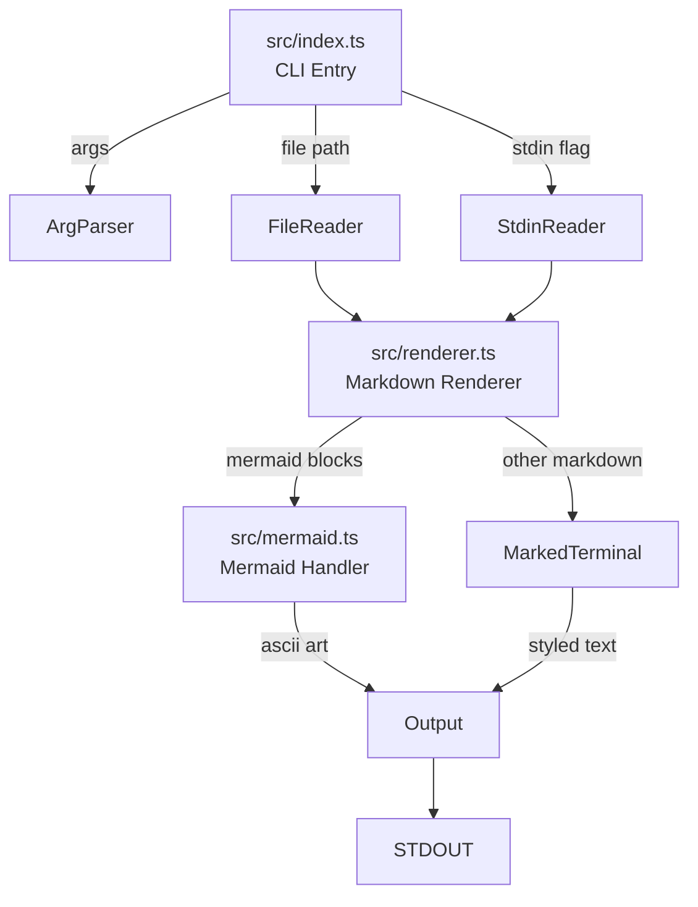

# Design: mdview

## Overview

Three-module architecture: CLI (entry), Renderer (markdown), Mermaid (diagrams). Clean separation enables testing and future extensibility.

## Architecture



## Components

### src/index.ts - CLI Entry
**Purpose**: Parse arguments, read input, orchestrate rendering

**Responsibilities**:
- Parse CLI arguments (file, -, --help, --version)
- Read file content or stdin
- Call renderer with content
- Handle errors and exit codes
- Output to stdout

**Interface**:
```typescript
// Main entry - no exports, runs on execution
// Arguments: Bun.argv.slice(2)
```

### src/renderer.ts - Markdown Renderer
**Purpose**: Convert markdown to terminal-styled output

**Responsibilities**:
- Configure marked with marked-terminal
- Detect mermaid code blocks
- Route mermaid to mermaid module
- Combine mermaid ASCII with rendered markdown

**Interface**:
```typescript
export interface RenderOptions {
  width?: number;  // terminal width, default 80
}

export function render(markdown: string, options?: RenderOptions): string;
```

### src/mermaid.ts - Mermaid Handler
**Purpose**: Convert mermaid code to ASCII art

**Responsibilities**:
- Parse mermaid syntax
- Call beautiful-mermaid
- Handle parsing errors gracefully
- Return fallback on failure

**Interface**:
```typescript
export interface MermaidResult {
  success: boolean;
  output: string;  // ASCII art or error box
}

export function renderMermaid(code: string): MermaidResult;
```

## Data Flow

1. CLI parses args, determines input source (file or stdin)
2. CLI reads content as string
3. CLI calls `render(content, { width: process.stdout.columns })`
4. Renderer extracts mermaid blocks via regex
5. Renderer calls `renderMermaid()` for each block
6. Renderer replaces mermaid blocks with ASCII output
7. Renderer passes modified markdown to marked-terminal
8. Renderer returns final styled string
9. CLI writes to stdout

## Technical Decisions

| Decision | Options | Choice | Rationale |
|----------|---------|--------|-----------|
| Arg parsing | commander, yargs, manual | Manual | Simple enough, no deps |
| Mermaid detection | marked plugin, regex pre-process | Regex pre-process | More control, simpler |
| Error display | throw, return Result | Return Result | Graceful fallback |
| Test framework | jest, vitest, bun:test | bun:test | Native, fast, no config |

## File Structure

| File | Action | Purpose |
|------|--------|---------|
| src/index.ts | Create | CLI entry, arg parsing, I/O |
| src/renderer.ts | Create | Markdown rendering logic |
| src/mermaid.ts | Create | Mermaid to ASCII conversion |
| src/index.test.ts | Create | CLI integration tests |
| src/renderer.test.ts | Create | Renderer unit tests |
| src/mermaid.test.ts | Create | Mermaid unit tests |
| package.json | Create | Dependencies, scripts |
| tsconfig.json | Create | TypeScript config |
| examples/test.md | Create | Test markdown file |

## Error Handling

| Error | Handling | User Impact |
|-------|----------|-------------|
| File not found | Exit 1, show path | "Error: File not found: path" |
| Read permission | Exit 1, show error | "Error: Cannot read file: path" |
| Invalid mermaid | Show raw in box | "[Mermaid Error] ...\n```code```" |
| Empty input | Show message | "No content to render" |
| No args | Show help | Help text |

## Mermaid Block Processing

```typescript
// Regex to extract mermaid blocks
const MERMAID_REGEX = /```mermaid\n([\s\S]*?)```/g;

// Process flow:
// 1. Find all matches with indices
// 2. For each match, call renderMermaid()
// 3. Build output string with replacements
// 4. Pass to marked-terminal (mermaid blocks now replaced)
```

## CLI Argument Matrix

| Input | Action |
|-------|--------|
| `mdview` | Show help |
| `mdview file.md` | Render file |
| `mdview -` | Render stdin |
| `mdview --help` | Show help |
| `mdview -h` | Show help |
| `mdview --version` | Show version |
| `mdview -v` | Show version |
| `mdview unknown.md` | Error: file not found |

## Existing Patterns to Follow
- Bun idioms for file I/O: `Bun.file().text()`, `Bun.stdin.text()`
- ESM imports throughout
- TypeScript strict mode
- Conventional commits for version control
